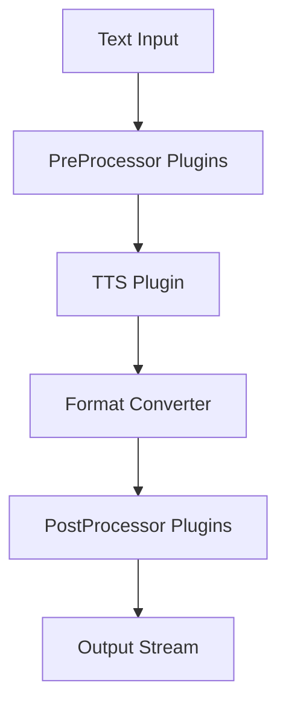

# Crusty-TTS Implementation Plan

This plan compiles everything from [ai-docs/planning/original-chat-formatted.md](ai-docs/planning/original-chat-formatted.md) into a single reference: design decisions, protocol, architecture, and code to copy over when implementing.

---

## 1. Vision and Goals

**What Crusty-TTS is**

- A **headless** TTS orchestration runtime (not an app with built-in GUI).
- **Orchestrator**: plugin registry, capability broker, validator, pipeline executor.
- **Protocol-driven**: plugins are subprocess workers; any language (Rust, Python, Go) can implement the contract.
- **Pipeline**: Pre-processing → Synthesis → Format conversion (MP3/etc) → Post-processing.

**v1 constraints (discipline)**

- Linear pipelines only (no branching, no parallel nodes).
- Content-type fixed per plugin execution.
- No distributed execution, no hot plugin reload.
- Validation before execution; fail fast.

**Non-goals (v1)**

- Crusty never does synthesis or encoding itself; plugins do.
- No implicit type coercion; output type of node N must match input type of node N+1.

---

## 2. Architecture

**Crate layout**

- **crusty-core** (library): plugin registry, manifest parsing, capability graph, orchestration validation, pipeline executor, streaming, security verification.
- **crusty-cli** (binary): loads orchestration, runs pipeline, streams to file/stdout, exits.
- **crusty-daemon** (binary): loads plugins at startup, exposes API, manages jobs, streams output. Same execution core as CLI.

**Pipeline flow**



**Shared execution**

- One function: `execute_pipeline(orchestration, input_stream) -> output_stream`.
- CLI and daemon both call it; no mode-specific logic in core.

---

## 3. Design Decisions (Consolidated)

| Area               | Decision                                                                                        |
| ------------------ | ----------------------------------------------------------------------------------------------- |
| **Plugin model**   | Subprocess workers (stdin/stdout), not dynamic libs. Language-agnostic, isolatable.             |
| **Capabilities**   | Declarative via manifest (plugin.toml). No guessing; validate at load.                          |
| **Data transport** | Framed stream: 4-byte length (little-endian) + payload. Content-type fixed per execution.       |
| **Handshake**      | First frame = control JSON: protocol, input_type, output_type, config. Then raw payload frames. |
| **Frames**         | Transport chunks only; no semantic boundaries. Plugins must not assume frame = logical unit.    |
| **Orchestration**  | orchestration.cr (TOML). MIME: application/x-crusty-orchestration. .cr or .or extension.        |
| **Interface**      | Core exposes API only. CLI, web, app are separate consumers.                                    |
| **Config layers**  | plugin.toml (capabilities), orchestration.cr (pipeline), daemon.toml (ports, sandbox, limits).  |
| **MP3/conversion** | Separate plugin type (audio processor). TTS outputs WAV; converter plugin produces MP3/OGG.     |
| **Meta-processor** | Single interface: plugin declares stage(s) pre/synth/encode/post and input/output types.        |
| **Versioning**     | protocol_version in manifest; core refuses incompatible. No silent fallback.                    |
| **Errors**         | Plugin emits structured error frame then exit non-zero. Fatal → abort pipeline.                 |

---

## 4. Plugin Protocol (v0.1)

**Process model**

- Crusty spawns plugin process, sends config, streams input, receives output.

**Frame format**

- `[4-byte length][payload bytes]` (content-type agreed in handshake).

**Handshake (first frame, JSON)**

```json
{
  "protocol": "0.1",
  "input_type": "application/ssml+xml",
  "output_type": "audio/raw",
  "config": { ... }
}
```

**Validation rule**

- For linear chain A → B → C: Output(A) ∩ Input(B) ≠ ∅, Output(B) ∩ Input(C) ≠ ∅.

**Error frame**

```json
{
	"type": "error",
	"message": "Description",
	"fatal": true
}
```

---

## 5. Plugin Manifest (plugin.toml)

**Required**

- name, version, protocol_version (or api_version), entrypoint (or module path).
- capabilities: input types, output types, mode (streaming/batch).

**Example (minimal)**

```toml
name = "piper"
version = "0.1.0"
protocol_version = "1"
entrypoint = "./plugin-binary"

[capabilities]
input = ["text/plain", "application/ssml+xml"]
output = ["audio/raw"]
mode = "streaming"
```

**Example (with options)**

```toml
name = "example-tts"
version = "0.1.0"
type = "tts"
description = "Converts text to speech."

[capabilities]
preprocessor = false
tts = true
postprocessor = false
output_formats = ["wav", "mp3"]

[options]
voice = { type = "string", default = "en_us" }
rate = { type = "float", default = 1.0, min = 0.5, max = 2.0 }
```

---

## 6. Orchestration File (orchestration.cr)

**Example (Foldedbits-style)**

```toml
[meta]
name = "Foldedbits TTS Pipeline"
version = "0.1.0"
author = "Louie"

[input]
type = "text"
source = "ebook.txt"

[[pre_processors]]
name = "normalize_whitespace"
module = "plugins/text/normalize_whitespace"
enabled = true
options = { trim = true, collapse_newlines = true }

[tts]
name = "crusty-tts-google"
module = "plugins/tts/google_cloud_tts"
voice = "en-US-Wavenet-D"
rate = 1.0
output_format = "wav"

[[audio_converters]]
name = "mp3_encoder"
module = "plugins/audio/mp3_encoder"
enabled = true
bitrate = "192k"

[[post_processors]]
name = "normalize_audio"
module = "plugins/audio/normalize"
enabled = true
options = { target_db = -3 }

[output]
type = "file"
path = "output/foldedbits_book.mp3"
overwrite = true
```

**Example (pipeline order + plugin options)**

```toml
[pipeline]
order = ["MarkdownPreprocessor", "ExampleTTS"]

[MarkdownPreprocessor.options]
strip_headers = true

[ExampleTTS.options]
voice = "Alice"
speed = 1.0
pitch = 1.0
```

---

## 7. Code to Copy Over

### 7.1 Core types (orchestration parsing)

```rust
// src/main.rs or core
use serde::Deserialize;

#[derive(Debug, Deserialize)]
struct Orchestration {
    meta: Meta,
    input: Input,
    pre_processors: Option<Vec<Plugin>>,
    tts: TTS,
    audio_converters: Option<Vec<Plugin>>,
    post_processors: Option<Vec<Plugin>>,
    output: Output,
}

#[derive(Debug, Deserialize)]
struct Meta { name: String, version: String, author: String }
#[derive(Debug, Deserialize)]
struct Input { r#type: String, source: String }
#[derive(Debug, Deserialize)]
struct Plugin { name: String, module: String, enabled: Option<bool>, options: Option<toml::Value> }
#[derive(Debug, Deserialize)]
struct TTS { name: String, module: String, voice: Option<String>, rate: Option<f32>, pitch: Option<f32>, output_format: Option<String> }
#[derive(Debug, Deserialize)]
struct Output { r#type: String, path: String, overwrite: Option<bool> }
```

### 7.2 Plugin traits (optional in-process plugins)

```rust
// src/plugin.rs
use std::collections::HashMap;
pub type PluginOptions = HashMap<String, String>;

pub trait PreProcessor {
    fn name(&self) -> &str;
    fn process(&self, input: &str, options: &PluginOptions) -> String;
}

pub trait TTS {
    fn name(&self) -> &str;
    fn synthesize(&self, input: &str, options: &PluginOptions) -> Vec<u8>;
}

pub trait PostProcessor {
    fn name(&self) -> &str;
    fn process(&self, input: &[u8], options: &PluginOptions) -> Vec<u8>;
}
```

### 7.3 Subprocess plugin runner

```rust
// src/plugin_runner.rs
use std::process::{Command, Stdio};
use std::io::Write;

pub fn run_subprocess_plugin(executable: &str, input: &[u8], _options: &HashMap<String, String>) -> Vec<u8> {
    let mut child = Command::new(executable)
        .stdin(Stdio::piped())
        .stdout(Stdio::piped())
        .spawn()
        .expect("Failed to start plugin");
    {
        let stdin = child.stdin.as_mut().expect("Failed to open stdin");
        stdin.write_all(input).expect("Failed to write input");
    }
    let output = child.wait_with_output().expect("Failed to read stdout");
    output.stdout
}
```

### 7.4 Plugin verification

```rust
pub fn verify_plugin(plugin_path: &str, plugin_type: &str) -> bool {
    if !Path::new(plugin_path).exists() {
        println!("Plugin not found: {}", plugin_path);
        return false;
    }
    let sample_input = match plugin_type {
        "pre" => b"Test input for pre-processor",
        "tts" => b"Hello, world!",
        "post" | "converter" => b"FAKE_AUDIO_BYTES",
        _ => b"Test",
    };
    let output = run_subprocess_plugin(plugin_path, sample_input, &PluginOptions::new());
    let valid = match plugin_type {
        "pre" => String::from_utf8(output.clone()).is_ok(),
        "tts" | "converter" | "post" => !output.is_empty(),
        _ => false,
    };
    valid
}
```

### 7.5 Plugin discovery (load from /plugins)

```rust
fn load_plugins(plugin_dir: &str) -> Vec<Plugin> {
    let mut plugins = vec![];
    for entry in fs::read_dir(plugin_dir).expect("Plugin directory not found") {
        let entry = entry.expect("Failed to read entry");
        if entry.path().is_dir() {
            let toml_path = entry.path().join("plugin.toml");
            if toml_path.exists() {
                let contents = fs::read_to_string(&toml_path).expect("Failed to read TOML");
                let parsed: toml::Value = contents.parse().expect("Invalid TOML");
                let name = parsed["name"].as_str().unwrap_or("Unnamed").to_string();
                let plugin_type = match parsed["type"].as_str().unwrap_or("pre") {
                    "pre" => PluginType::Pre,
                    "tts" => PluginType::TTS,
                    "post" => PluginType::Post,
                    "converter" => PluginType::Converter,
                    _ => PluginType::Pre,
                };
                plugins.push(Plugin { name, plugin_type, path: entry.path().to_string_lossy().to_string(), options: PluginOptions::new() });
            }
        }
    }
    plugins
}
```

### 7.6 Pipeline execution (high level)

```rust
fn run_pipeline(input_text: &str, plugins: &[Plugin]) -> Vec<u8> {
    let mut text = input_text.to_string();
    let mut audio: Vec<u8> = vec![];
    for p in plugins.iter().filter(|p| matches!(p.plugin_type, PluginType::Pre)) {
        audio = run_subprocess_plugin(&p.path, text.as_bytes(), &p.options);
        text = String::from_utf8(audio.clone()).expect("Pre-plugin must return UTF-8 text");
    }
    for p in plugins.iter().filter(|p| matches!(p.plugin_type, PluginType::TTS)) {
        audio = run_subprocess_plugin(&p.path, text.as_bytes(), &p.options);
    }
    for p in plugins.iter().filter(|p| matches!(p.plugin_type, PluginType::Post | PluginType::Converter)) {
        audio = run_subprocess_plugin(&p.path, &audio, &p.options);
    }
    audio
}
```

### 7.7 Example plugin interface (run.sh + env)

- Plugin receives `PLUGIN_INPUT` (text or file path) and `PLUGIN_OPT_<NAME>` for options.
- Writes result to stdout (or path). Crusty can use `run.sh` per plugin folder.

**TTS run.sh (concept)**

```bash
INPUT_TEXT="${PLUGIN_INPUT:-}"
VOICE="${PLUGIN_OPT_VOICE:-en_us}"
# e.g. espeak or any TTS; output WAV to stdout or path
```

**MP3 converter run.sh (concept)**

```bash
INPUT_FILE="${PLUGIN_INPUT:-input.wav}"
ffmpeg -y -i "$INPUT_FILE" output.mp3
echo "output.mp3"
```

---

## 8. API Surface (Daemon)

- `GET /plugins` — list installed plugins
- `GET /plugins/{id}` — capabilities + options schema
- `POST /pipeline/validate` — validate orchestration
- `POST /pipeline/run` — execute pipeline (returns job id)
- `GET /jobs/{id}/status`
- `GET /jobs/{id}/stream` — stream output

REST recommended for v1; gRPC optional later.

---

## 9. File Structure to Create

```
crusty-tts/
├── Cargo.toml              # workspace: crusty-core, crusty-cli, crusty-daemon
├── plan.md                 # this document (save here)
├── crusty-core/
│   ├── Cargo.toml
│   └── src/
│       ├── lib.rs
│       ├── orchestration.rs
│       ├── plugin.rs
│       ├── plugin_runner.rs
│       ├── pipeline.rs
│       └── protocol.rs     # frame format, handshake
├── crusty-cli/
│   ├── Cargo.toml
│   └── src/main.rs
├── crusty-daemon/
│   ├── Cargo.toml
│   └── src/main.rs
└── plugins/
    ├── sample-tts/
    │   ├── plugin.toml
    │   └── run.sh
    └── mp3-converter/
        ├── plugin.toml
        └── run.sh
```

---

## 10. Implementation Phases

1. **Scaffold** — Create workspace, crusty-core with orchestration + plugin types, crusty-cli that loads orchestration.cr and runs mock pipeline.
2. **Protocol** — Frame format (4-byte length + payload), handshake JSON, config passing; plugin_runner sends handshake then frames.
3. **Discovery** — Load plugin.toml from /plugins, build registry, validate types.
4. **Verification** — health_check / mini synth test per plugin before pipeline run.
5. **Pipeline** — Pre → TTS → converter → post with subprocess runner and type checking between stages.
6. **Interactive CLI** — Discover plugins, prompt for selection and options, write orchestration.cr.
7. **Daemon + API** — REST endpoints, job management, stream endpoint; same execute_pipeline core.

---

## 11. Deliverable

**Save this entire plan as `plan.md`** at the repo root ([plan.md](plan.md)) so it serves as the single source of truth for building the app, with all design decisions and code in one place.
